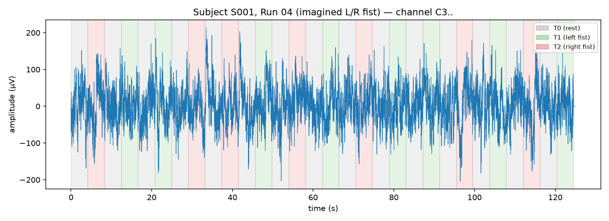

# FA26 — Left vs. Right Fist EEG Classification

## What this is
Working notes for the FA26 recruitment challenge (motor imagery/execution,
left vs. right fist, PhysioNet EEGMMIDB). This file is the running log +
open-questions list the challenge asks for ("log your attempts").

## Data, as found
- `data/` = EEGMMIDB, already downloaded: 109 subjects (`S001`-`S109`),
  each with 14 runs (`S###R01.edf`...`S###R14.edf`) + matching `.edf.event`
  files (ground-truth annotations, redundant with the annotations embedded
  in the EDF itself — used both as a cross-check).
- Confirmed via `mne.io.read_raw_edf`: 64 EEG channels, nominally 160 Hz,
  annotations `T0`/`T1`/`T2` per run.
- Run mapping (confirmed against the PDF instructions + by checking which
  runs actually contain T1/T2 vs. only T0):
  - Runs 3, 7, 11: **executed** left/right fist. T1=left, T2=right.
  - Runs 4, 8, 12: **imagined** left/right fist. T1=left, T2=right.
  - Runs 5,9,13 / 6,10,14: both-fists-vs-both-feet (not used for this task).
  - Runs 1, 2: eyes-open/closed baseline (no T1/T2, not used).
- **This task only uses T1/T2 trials, never T0 (rest)** — the assignment
  is left-fist-vs-right-fist, not fist-vs-rest.

### Known data-quality issues
- S088: recorded at 128 Hz instead of 160 Hz, with 19 trials instead of 15, and irregular trial durations (1.38-5.12s vs. a consistent ~4.1s)
- S092: recorded at 128 Hz instead of 160 Hz, with 19 trials instead of 15, and irregular trial durations (1.38-5.12s vs. a consistent ~4.1s)
- S100: recorded at 128 Hz instead of 160 Hz, with 12 trials instead of 15, each abnormally long (~5.1s vs. ~4.1s)
- S089: run duration is 181s instead of the standard 125s, with 22 trials instead of 15
- S104: run duration is 106s instead of the standard 125s, with 13 trials instead of 15
- Trial counts per run are not always exactly 15 (e.g., S034/S037 executed
  runs have 14 trials instead of 15) — handled naturally since the loader
  counts actual annotations rather than assuming a fixed count.
- Did **not** exhaustively QC all 109 subjects' impedance/noise levels —
  see ToDo below. There are documented issues with a handful of EEGMMIDB
  subjects (channel corruption, mislabeled events) reported by other
  groups using this dataset; I have not cross-checked against those
  reports.

## Folder Structure
data/ \
|-- ANNOTATORS                    \
|-- RECORDS                       \
|-- 64_channel_sharbrough.pdf     \
|-- S001/                         \
|-- |-- S001R01.edf               \
|-- |-- S001R01.edf.event         \
|-- S002/  ... (same pattern)     \
|-- ...                           \
|--  S109/  ... (same pattern)

## Files
For this project, only Runs # 3, 4, 7, 8, 11, and 12 are used.

| Run | Task | Condition | Subjects (.edf files) | .edf.event files | 
|-----|------|-----------|-----------------------|------------------|
|03 | Left vs. right fist | Executed | 109 | 109 |
|04 | Left vs. right fist | Imagined | 109 | 109 |
|07 | Left vs. right fist | Executed | 109 | 109 |
|08 | Left vs. right fist | Imagined | 109 | 109 |
|11 | Left vs. right fist | Executed | 109 | 109 |
|12 | Left vs. right fist | Imagined | 109 | 109 |

.edf (European Data Format): Actual Signal
  - Standard binary file format for storing multi-channel biosignal recordings (EEG, EMG, ECG, etc.).
  - Contains: a header (subject metadata, recording start time, number of channels, channel labels, sample rate, physical/digital signal ranges) followed by  the raw digitized signal samples (16bit signed integer) for every channel.
  - In this dataset: 64 EEG channels sampled at 160 Hz, continuous recording for the full run duration (~2 minutes for runs 3-14).
  - Annotations (event markers T1/T2) are also embedded inside the EDF itself as an "EDF+ Annotations" channel

.edf.event: Separate Annotations (e.g., T1: Left Fist, T2: Right Fist)

## Data Values
- Digital Value: 
  - Each raw digitized signal sample (16bit signed integer) stored in edf file is a measurement value from the EEG electrode
    - An electrode picks up electrical potential from neural activity
    - Amplifier boosts the signal
    - Anti-aliasing Filter is applied to prepare for conversion to digital values
    - ADC converts analog values to digital values sampled at 160Hz
  - Data has been collected from 64 electrodes (channels) as shown in ***64_channel_sharbrough.pdf***
  - Each .edf file contains 64 parallel samples captured at 160Hz
- Physical Value: 
  - Converted from Digital Value to microvolts ($\mu V$) of electrical potential at the scalp
    - Conversion Equation: 
  - Visualization of a single channel/electrode (C3) from one subject (S001) during Run #4
    - x axis: time in second
    - y axis: physical value in microvolts $\mu V$
    - colored band: Annotation value (T0, T1, T2)

    

## Environment
- Set up a project-local venv at `~/FA26/.venv` 
- `requirements.txt` has pinned versions
  - This file lists all the packages that need to be installed for the project to run
- To reproduce, run on Terminal:
  - cd ~/FA26
  - python3.11 -m venv .venv
  - .venv/bin/pip install -r requirements.txt
  - source .venv/bin/activate

## Pipeline (`src/`)

### `data.py`
| Function | What it does |
|---|---|
| `_runs_for(run_type)` | Maps `"executed"`/`"imagined"`/`"both"` to the corresponding run numbers (3,7,11 / 4,8,12 / all six) |
| `subject_run_path(subject, run, data_dir)` | Builds the file path for a given subject+run, e.g. `data/S001/S001R04.edf` |
| `load_raw(subject, run, data_dir)` | Reads one EDF file, standardizes channel names/montage, resamples to 160 Hz if needed |
| `raw_to_epochs(raw, tmin, tmax, l_freq, h_freq)` | Bandpass-filters (7-30 Hz) and epochs a loaded `raw` object into T1/T2 trials |
| `build_dataset(subjects, run_type, ...)` | Loops over many subjects/runs, calls `load_raw`+`raw_to_epochs` on each, crops to 1-2s window, stacks everything into one `Dataset` |
| `Dataset` (dataclass) | Container for the final `X`, `y`, `groups`, and metadata returned by `build_dataset` |

### `model.py`
| Function | What it does |
|---|---|
| `build_pipeline(n_components, reg)` | Constructs a scikit-learn `Pipeline`: `CSP` (spatial filtering) → `LinearDiscriminantAnalysis` (classifier) |

### `evaluate.py`
| Function | What it does |
|---|---|
| `within_subject_cv(build_pipeline_fn, X, y, groups, ...)` | Per-subject 5-fold shuffled CV (train/test trials from the same subject) — optimistic upper bound |
| `leave_one_subject_out(build_pipeline_fn, X, y, groups, shuffle_labels, ...)` | Trains on N-1 subjects, tests on the held-out one, repeats for all subjects; `shuffle_labels=True` runs the permutation-baseline control |
| `group_kfold_cv(build_pipeline_fn, X, y, groups, n_splits)` | Faster stand-in for LOSO — folds respect subject grouping but hold out several subjects per fold at once |
| `summarize(results, title)` | Formats a results dict (mean/std/min/max, confusion matrix) into a printable string |

### `train.py`
| Function | What it does |
|---|---|
| `parse_subjects(spec)` | Parses a CLI string like `"1-40"` or `"1,2,5-10"` into a list of subject IDs |
| `main()` | Orchestrates the full experiment: parses args → `build_dataset()` → runs within-subject CV, LOSO, and permutation baseline → writes JSON results → fits and saves a final model (`.joblib`) on all loaded data |

### `predict.py`
| Function | What it does |
|---|---|
| `predict_edf(model_path, edf_path)` | Loads a saved model + one raw EDF, preprocesses it the same way as training (`raw_to_epochs`), aligns channels, and returns per-trial predictions (plus true labels if available) |
| `main()` | CLI entry point: parses `--model`/`--edf` args, calls `predict_edf`, prints per-trial results and overall accuracy if ground truth is present |

### `plot_results.py`
| Function | What it does |
|---|---|
| No functions | Loads `results_executed_40.json`/`results_imagined_40.json` |
|              | Builds a two-panel scatter plot of per-subject LOSO accuracy (real vs. permuted labels) |
|              | Saves `results/loso_accuracy.png` |

## Roles  
- `data.py`:    shared toolkit; how to turn a raw EDF into model-ready trials.
- `model.py`:   definition of what the model architecture is.
- `evaluate.py`: how to honestly measure accuracy given a dataset and a trained model.
- `train.py`:   run the whole training + evaluation experiment end-to-end.
- `predict.py`: test the trained model. it classifies one new file with an already-trained model.
- `plot_results.py`: turn saved results from training + evaluation into a figure (not from predict.py)

## How to Run
1. Run Training
  - .venv/bin/python src/train.py --subjects 1-40 --run_type executed --tag executed_40
  - .venv/bin/python src/train.py --subjects 1-40 --run_type imagined --tag imagined_40
  - .venv/bin/python src/train.py --subjects 1-109 --run_type executed --loso_only --tag executed_full
  
  - The training dataset can be selected using the --subjects flag
    - To select non-consecutive subjects for training, use ***--subjects 1-10, 33, 50-55***

  - To remove the 5 bad datasets from training, set the --exclude_bad flag, for example,
    - .venv/bin/python src/train.py --subjects 1-40 --run_type imagined --exclude_bad --tag imagined_40

  - During training, the data (selected by the --subjects flag) is divided into 2 sets, training set and evaluation set.
    - The training set is used to train the model.
    - The evaluation set is used to evaluate the accuracy of the trained model.
    - We want the evaluation set to be different from the training set so that we don't cheat (test on the training set)
    - We can dictate how much data is used for training and how much for evaluation using the --train_ratios flag.
    - for example, if you set --train_ratios 0.8, then 80% of the data will be used for training and 20% for evaluation
    - Run ***.venv/bin/python src/train.py --subjects 1-40 --run_type imagined --exclude_bad --train_ratios 0.8 --tag imagined_40***

  - You can train the model with both "executed" and "imagined" signals ***--run_type both***
    - This will include all of 6 runs (3 executed and 3 imagined) from each subject
    - This design does not allow you to choose from the 6 runs in each subject
    - To test different combinations of training sets between executed and imagined, you set --run_type to both and then select list of subjects to train with

  - Training produces two files
    - A JSON File: /results/results_<tag>.json
    - Trained Model: /results/model_<tag>.joblib

2. Run Inference (Prediction)
  - After your model is trained, you can test it by running it with a new input data
  - Your trained model from Step #1 above is a joblib file (e.g., model_executed_40.joblib)
  - Your test input data is an edf file (e.g., S050R03.edf)
  - Run: .venv/bin/python src/predict.py --model results/model_executed_40.joblib --edf data/S050/S050R03.edf
  
  - Prediction prints out the classification result: left_fist or right_fist
  - Subjects that were not included in the training session via --subjects can be used for inference tests
    - These are not used for model training, so there is no over-fitting (it's cheating to train and test on the same data)
    - For example, if you ran ***train.py --subjects 1-89***, then all subjects 90-109 are free to use for inference

3. Visualize Trained Model
  - Visualize accuracy evaluation result of the trained model from 
    - results/results_executed_40.json
    - results/results_imagined_40.json
  - Run ***.venv/bin/python src/plot_results.py***

## Evaluation Design (why 3 regimes, not one number)
1. **Within-subject CV** (`ShuffleSplit`, 80/20, 5 repeats, per subject):
   most optimistic number. CSP/LDA get to fit that person's exact head
   geometry/noise. Useful as an upper bound, not as evidence of
   generalization.
2. **Leave-one-subject-out (LOSO)**: fit on N-1 subjects, test on the held
   out one, repeated for all subjects. This is the number that matters for
   "does this work on a new person" - the framing the prompt cares about.
3. **Permutation baseline**: same LOSO procedure, but labels shuffled
   *within each subject* before fitting (preserves per-subject class
   balance, breaks the left/right correspondence). If real is close to permuted,
   the real number isn't measuring left-vs-right content.

All subject-grouped splits use subject IDs as groups so no subject's
trials appear in both train and test in the same fold - the single most
important control here, since within-subject leakage (same head, same
session noise) is confounded with the fist label unless explicitly split
out.

## Results so far (n=40 subjects, S001-S040)

| Regime | Executed (3,7,11) | Imagined (4,8,12) |
|---|---|---|
| Within-subject CV | 0.579 (± 0.122) | 0.536 (± 0.164) |
| **LOSO, real labels** | **0.543 (± 0.070)** | **0.546 (± 0.092)** |
| LOSO, permuted labels | 0.478 (± 0.048) | 0.503 (± 0.049) |
| Paired t-test (real vs. permuted, per-subject) | t=4.26, p=0.0001 | t=2.85, p=0.007 |

See `results/loso_accuracy.png` for the full per-subject spread (sorted),
`results/results_executed_40.json` / `results_imagined_40.json` for raw
numbers, `results/model_executed_40.joblib` / `model_imagined_40.joblib`
for the saved pipelines predict.py loads.

**Reading of these numbers:**
- LOSO real accuracy (~0.54-0.55) is statistically distinguishable from
  the permutation baseline (~0.48-0.50) — there is a real, if weak,
  cross-subject left/right signal being picked up, consistent with the
  literature's characterization of this task as "weak, noisy, unreliable."
- Executed and imagined are statistically similar at this scale (both
  ~0.54), which was mildly surprising — I expected executed to show a
  clearer LOSO advantage given its stronger single-subject signal
  (within-subject CV is a bit higher for executed: 0.579 vs 0.536). More
  subjects and/or a paired same-subject executed-vs-imagined comparison
  would sharpen this.
- Per-subject spread is wide (min 0.467/0.378, max 0.778/0.822) — a
  single mean accuracy badly understates how variable this is. Some
  subjects are near chance under real labels; a few are much better than
  the mean. This is exactly the "range, not best case" the prompt asks for.
- Within-subject CV overstates generalizable performance relative to
  LOSO, as expected, but the gap is smaller than I initially guessed —
  suggesting the CSP+LDA model isn't wildly overfitting to individual
  subject idiosyncrasies once shrinkage-regularized; it's just that the
  cross-subject signal itself is weak.

## Deep Dive into Model: CSP + LDA
### CSP: Common Spatial Patterns
CSP finds a set of spatial filters - linear combinations of the 64 channels/electrodes  such that when you look at the variance of the resulting signal:

  - One filter's output has maximum variance for class A and minimum variance for class B
  - Another filter's output has the opposite: maximum for B, minimum for A

To apply a weighted sum of 64 channels, you need a filter of length = 64 so each of 64 filter coefficients weighs one channel. To build a covariance matrix, the filter shape is 64x64.
csp.filters_.shape is fixed to (64, 64) because of the 64 channels in input data.
That means, there are 64 separate candidate filters (each of length = 64) being trained.
CSP learns this 64x64 filter (spatial covariance matrix) from training.

Interface: 
  - Input: all training trials' 64×64 spatial covariance matrices (per class)
  - Output: csp.filters_, the full 64×64 eigenvector matrix — this is the thing that gets computed via eigendecomposition, and yes, this is genuinely "learned from data" (the eigenvectors depend entirely on your specific training trials' covariance structure).
  - Only the top+bottom 4 rows (n_components=4) are kept and used going forward.

Parameters:
  1. Out of the 64 separate filters, only 4 filters are used by setting n_components. This keeps the top 2 filters from each end of the spectrum (2 "most left-favoring" + 2 "most right-favoring"). Each of the 64 raw channels gets collapsed down to just 4 new virtual channels — each one a specific weighted combination of electrodes designed to separate the two classes by variance.

  2. log=True: after applying the filters, CSP takes the log-variance of each of the 4 filtered signals as the actual feature — 4 numbers per trial. Log-variance is used (rather than raw variance) because band-power values are typically log-normally distributed; this makes the LDA's linear-boundary assumption more valid.

  3. reg='ledoit_wolf': CSP's math needs to estimate a 64x64 covariance matrix from each trial's data. With only ~160 time samples per trial (after cropping to the 1-2s analysis window) and 64 channels, that covariance estimate is numerically unstable - Ledoit-Wolf shrinkage pulls the estimate toward a better-conditioned matrix, stabilizing it.

### LDA: Linear Discriminant Analysis
LDA does the actual classification: it finds a single straight-line (hyperplane, in 4D) boundary that best separates the two classes' 4-dimensional feature points (n_components = 4), assuming both classes are Gaussian-distributed with the same covariance.

Interface:
  - Input: every training trial's 4 CSP log-variance numbers, plus its true label
  - Output: lda.coef_, shape (1, 4) — 4 numbers, one weight per CSP feature — plus lda.intercept_, a single bias term
  - This defines a linear decision rule: score = 0.0063·f1 - 0.1455·f2 + 0.2890·f3 - 0.1094·f4 - 0.1191, and the predicted class is whichever side of zero that score lands on.

## What I have NOT yet done (ToDo)
- [ ] Experiment with different number of subjects to train, different values of run_type
- [ ] CSP learns 64x64 matrix, but selects only top 4 filters from it by setting n_components = 4.    
      Experiment with this value and see it affects the accuracy of the model.
- [ ] Scale LOSO to the full 109 subjects (currently n=40, chosen for
      turnaround time in this pass — training + evaluating all 109 with
      full LOSO is ~3x this runtime; queued as a follow-up run).
- [ ] Quantify "how much of this is about the person, not the task" more
      directly: e.g., train a subject-identity classifier on the same
      features and see how well subject ID alone is decodable, to bound
      how much of any left/right signal could ride on subject-correlated
      artifacts. Currently I only have the permutation-baseline control,
      which addresses label-shuffling but not a full subject-confound
      audit (e.g., electrode impedance differences, session-to-session
      amplifier drift).
- [ ] Test whether a model trained on **executed** runs transfers to
      **imagined** runs (and vice versa) — explicitly suggested in the
      prompt as "fair game and possibly interesting." Not yet run.
- [ ] Try a channel subset restricted to sensorimotor electrodes (C3, C4,
      Cz and neighbors) instead of all 64 — both as a sanity check (does
      CSP concentrate its spatial patterns there, as physiology predicts?)
      and as a way to test robustness to electrode-count mismatches on
      other EDF files.
- [ ] Look at what CSP is actually learning: plot the spatial patterns
      (`CSP.plot_patterns`) for a few subjects to check whether the
      topography is plausible (contralateral sensorimotor, roughly
      symmetric between left/right) rather than picking up an artifact
      (e.g., a bad channel, eye-movement contamination near frontal
      electrodes).
- [ ] Sweep the crop window (currently fixed 1-2s post-cue) and the
      band-pass range (currently fixed 7-30 Hz) — both were taken from the
      standard MNE tutorial defaults referenced in the challenge PDF, not
      independently tuned or justified for this dataset.
- [ ] Cross-check accuracy against a hand-crafted spectral-power baseline
      (log-bandpower in mu/beta per channel -> LDA, no CSP) to isolate how
      much CSP's spatial filtering specifically contributes versus a
      simpler feature.
- [ ] Full data QC pass: I have not screened all 109 subjects for bad
      channels / flat channels / motion artifact beyond the coarse
      sfreq/trial-count check already done for S088/S092/S100. Some
      literature on EEGMMIDB reports specific subjects with known
      recording issues — I have not cross-referenced that list.
- [ ] `predict.py` currently assumes the EDF has all 64 standard channels
      in a nameable/standardizable form (via `mne.datasets.eegbci.standardize`).
      Have not tested it against a file with a different channel montage
      or a partial channel set — worth hardening before calling it a real
      deliverable-grade CLI.
- [ ] Demo video, README with pinned one-line usage example, and GitHub
      repo publication are not done yet — this session focused on the
      technical pipeline and its evaluation.

## Open questions / things I'd want to defend or am least sure of
- Is 1-2s post-cue the right window for *executed* trials specifically?
  Movement onset latency for executed fist clenches may differ from
  imagined ones; using the same fixed crop for both may quietly
  disadvantage one condition. Not yet checked.
- The permutation baseline shuffles within-subject, which controls for
  subject-level confounds but not for run-order or fatigue/drift-within-
  run confounds (e.g., if T1 trials cluster earlier in a run than T2 for
  incidental protocol reasons, permuting within-subject-across-all-trials
  won't catch a within-run temporal bias). Would want to also try
  shuffling within-run rather than within-subject to rule this out.
- LOSO with only 40 subjects gives per-subject accuracy estimates with
  meaningful sampling noise (as few as ~42-45 trials per held-out
  subject for executed runs). The between-subject std (~0.07-0.09) partly
  reflects subject differences and partly reflects small-n measurement
  noise per subject — haven't decomposed those two sources.
- Haven't yet checked whether accuracy correlates with anything
  measurable about a subject (session length, recording date, channel
  noise level) that would indicate a data-quality confound rather than a
  genuine physiological difference in imagery/execution ability.

## AI tool use
Used this AI assistant (Enchanté, running Claude) to read the challenge
PDFs, inspect the dataset structure interactively (EDF header content, run
annotation labels, sfreq irregularities), scaffold the pipeline code above,
and run/summarize experiments. One specific choice made and reasoned about
directly (not just accepted from the tutorial default): using
Ledoit-Wolf-shrinkage-regularized CSP covariance (`reg='ledoit_wolf'`)
rather than the tutorial's unregularized default (`reg=None`) — the
64-channel spatial covariance is estimated from only ~160 time samples per
trial after cropping to the 1s analysis window, which is close to
rank-deficient (fewer samples than channels means the raw sample
covariance is not even guaranteed full rank), so shrinkage was chosen
deliberately rather than left at the tutorial's default.
